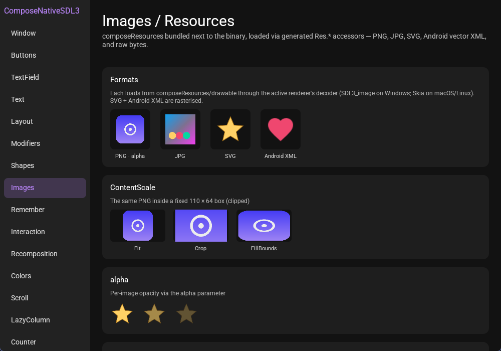
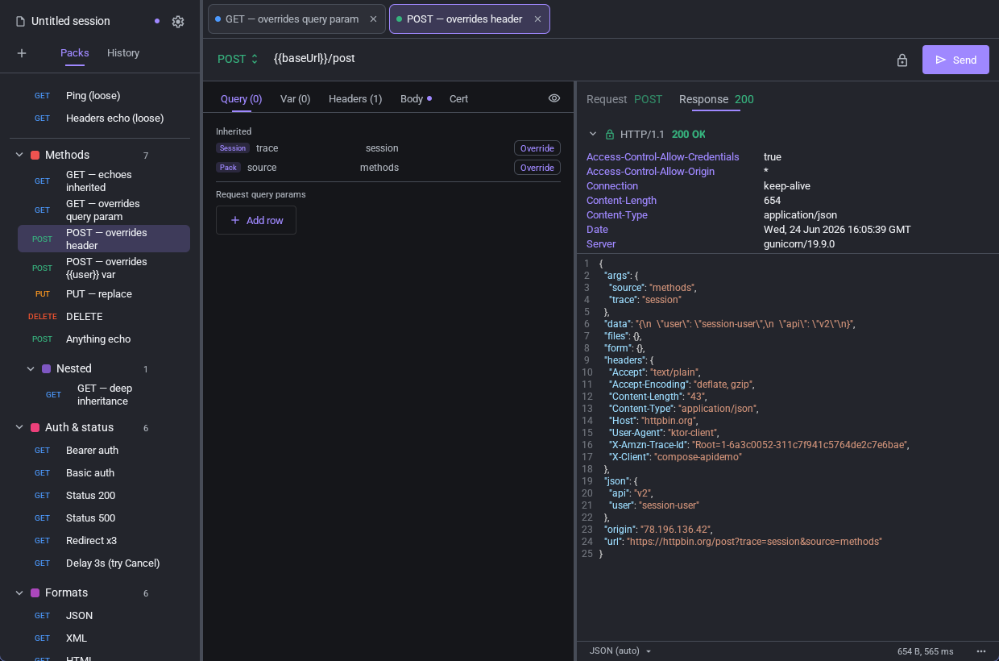

[](https://kotlinlang.org)

# Compose Desktop Native

A Kotlin/Native port of **Compose Multiplatform** running on **SDL3** for
windowing and input — **no JVM**. Compiles to native binaries for macOS
(arm64), Linux (x64/arm64), Windows (mingwX64).

Rendering is pluggable behind one `RenderBackend`:

- **Skia** (via Skiko klibs) on macOS + Linux — Metal / OpenGL / CPU raster.
- **SDL3** (`SDL3_ttf` + `SDL_RenderGeometry`) on Windows, and on macOS/Linux
  when `-Prenderer=sdl3` is passed.

The Compose **runtime** is the official
`org.jetbrains.compose.runtime:runtime` klibs from Maven — this project
re-implements the layers on top of it (`androidx.compose.ui.*`,
`.foundation.*`, `.animation.*`, `.material3.*`) by **vendoring
upstream Compose Multiplatform verbatim** whenever possible and hand-rolling
project actuals + SDL3 / Skia glue only where needed.

## Module layout

One Gradle module per upstream Compose artifact — the directory tree mirrors
upstream's `compose/` layout, gradle paths stay short via `projectDir`
redirects.

```
compose/
├── ui/
│   ├── ui/               → :ui              (androidx.compose.ui.* + renderers + cinterops)
│   ├── ui-util/          → :ui-util
│   ├── ui-geometry/      → :ui-geometry
│   ├── ui-unit/          → :ui-unit
│   ├── ui-backhandler/   → :ui-backhandler
│   └── ui-tooling-preview/ → :ui-tooling-preview (common @Preview + PreviewParameterProvider —
│                                             IDE-only metadata; previews render via the apps' jvm targets)
├── animation/
│   ├── animation-core/   → :animation-core
│   ├── animation/        → :animation
│   └── animation-graphics/ → :animation-graphics
├── foundation/
│   ├── foundation/       → :foundation
│   └── foundation-layout/ → :foundation-layout
├── material3/material3/  → :material3
├── material/material-ripple/ → :material-ripple
└── sdl/                  (project modules — the SDL integration layer)
    └── window/           → :window          (nativeComposeApp { Window(...) } + SDL3 main loop,
                                              per-window Lifecycle/ViewModelStore/SavedState owners)

utils/
└── material-symbols/    → :material-symbols (Material Symbols: 4200+ codepoints + Outlined/Rounded/
                                              Sharp composables with the variable-font axes as
                                              parameters (FILL/wght/GRAD/opsz). Common API — native
                                              draws via the port's icon-font engine, the jvm target
                                              via Skiko, so shared app code uses it on both stacks)

components/
└── resources/library/    → :components-resources (vendored official compose resources runtime —
                                              painterResource/stringResource/Res codegen; the Maven
                                              artifact ships no mingwX64/linux klibs)

navigation3/
└── navigation3-ui/       → :navigation3-ui  (vendored NavDisplay + scene machinery — the one
                                              Navigation 3 layer without a K/N desktop artifact)

gradle-plugin/
└── compose-desktop-native-bridge/ → :compose-desktop-native-bridge (the consumer-side bridge, published
                                              as a Gradle plugin — see "Using it from your own build")

demo/     → :demo     (showcase + CLI probe suite; multiplatform — the same screens
                       also build for stock JVM Compose Desktop as a parity reference)
apidemo/  → :apidemo  (Postman-style REST client; multiplatform — same UI on JVM too)
```

## demo — widget & feature showcase



`:demo` is a full tour of the re-implemented Compose + Material 3 surface —
30+ sidebar screens covering buttons, text fields, layout, modifiers, shapes,
images, state & recomposition, scrolling & lazy lists, dialogs, icons, canvas,
graphics layers, custom layout, animation and gestures.

```bash
./gradlew :demo:runDebugExecutableMacosArm64      # macOS  (Skia / Metal)
./gradlew :demo:runDebugExecutableLinuxX64        # Linux  (Skia / OpenGL)
gradlew.bat :demo:runDebugExecutableMingwX64      # Windows (SDL3)
./gradlew :demo:run                               # stock JVM Compose Desktop (parity reference)
```

The same shared screens drive both stacks — the JVM target runs them on
upstream Compose Desktop unchanged, so any visual or behavioural difference
against the native build is a porting bug, not a demo artifact.

CLI: `--gpu=…`, `--screen=<Name>` (one screen, no sidebar),
`--screenshot=out.bmp --frames=N`, `--width=W --height=H`.

## apidemo — API Manager



`:apidemo` is a Postman-style REST client built entirely on the library:
request collections (**packs**, nested sub-packs, linked copies), a
**Session → Pack → Request** inheritance ladder for variables / headers /
query params / client certs, syntax-highlighted JSON / XML / YAML / HTML body
editors, a response viewer with timing, size and TLS-chain inspection, mTLS
client certificates, drag-and-drop tree management, request history and
file-based sessions.

```bash
./gradlew :apidemo:runDebugExecutableMacosArm64
./gradlew :apidemo:runDebugExecutableLinuxX64
gradlew.bat :apidemo:runDebugExecutableMingwX64
./gradlew :apidemo:run                            # stock JVM Compose Desktop (parity reference)
```

Like the demo, the whole UI lives in `commonMain` and also runs on upstream
Compose Desktop (JVM); only the mTLS / TLS-chain features are native-only —
they drive the bundled libcurl directly.

Add `-Prenderer=sdl3` on macOS/Linux to drop Skiko and use the pure-SDL3
renderer everywhere.

## Minimal app

```kotlin
import androidx.compose.material3.Text
import com.compose.sdl.nativeComposeWindow

fun main() = nativeComposeWindow(title = "Hello") {
    Text("Hello from ComposeNativeSDL3")
}
```

The lambda runs with a `ComposeWindowScope` receiver exposing
`window: ComposeNativeWindow` (`setTitle` / `setSize` / `minimize` /
`maximize` / `setFullscreen` / `close` / …); the same handle is reachable
from any nested composable via `LocalComposeNativeWindow.current`.

Add these to your module's `commonMain.dependencies`:

```kotlin
implementation(project(":window"))            // window + main loop
implementation(project(":material3"))         // Material 3 widgets
implementation(project(":material-symbols"))  // icon-font composables (optional)
```

## Using it from your own build — the bridge plugin

The klibs publish to GitHub Packages under `com.bitsycore.compose.sdl:*`, and
a companion Gradle plugin ships the "redirect trick" this repo uses
internally: apply **`com.bitsycore.compose-desktop-native.bridge`** once in
`settings.gradle.kts` and declare the **official Compose Multiplatform
coordinates** in `commonMain` — the plugin substitutes the port's klibs on
every native desktop configuration (mingwX64 / linuxX64 / linuxArm64 /
macosArm64), while android / jvm / iOS / wasm keep resolving the official
artifacts. One dependency list, all CMP platforms + the port's new ones.

```kotlin
// settings.gradle.kts
plugins { id("com.bitsycore.compose-desktop-native.bridge") version "<release>" }

// build.gradle.kts — official coords, everywhere
commonMain.dependencies {
    implementation("org.jetbrains.compose.runtime:runtime:<runtime-version>")
    implementation("org.jetbrains.compose.ui:ui:<cmp-version>")
    implementation("org.jetbrains.compose.foundation:foundation:<cmp-version>")
    implementation("org.jetbrains.compose.material3:material3:<cmp-m3-version>")
}
```

Setup details (repositories, credentials, version pinning):
[gradle-plugin/compose-desktop-native-bridge/README.md](gradle-plugin/compose-desktop-native-bridge/README.md).

## Building

All four native dependencies — **SDL3**, **SDL3_ttf** (the in-house
variable-font-axes fork), **SDL3_image** (+ vendored PNG/WEBP codecs) and
**FreeType** — are built from source as **static** libraries by one script,
on every OS, and linked straight into the executable. No `brew install`, no
`apt install libsdl3-dev`, no runtime `.dll` / `.so` / `.dylib` next to the
binary — a distributable is just `<app>` + `data.kres`.

```bash
python3 scripts/build-sdl/build-all.py            # freetype → sdl3 → sdl3-image → sdl3-ttf
python3 scripts/build-sdl/build-all.py sdl3-ttf   # rebuild a subset
```

Library versions / URLs are pinned in `scripts/build-sdl/build-sdl.properties`;
output lands in the gitignored in-repo `libs/`. Required on every host: `git`,
`cmake`, Python 3 (`ninja` is fetched automatically when absent). Per host:

- **macOS** — Xcode command line tools. Skia is the default renderer; Skiko
  klibs come from Maven.
- **Linux** — gcc/g++ plus the X11 / Wayland / audio dev headers SDL3's
  configure detects (the exact apt list is in
  `.github/workflows/publish.yml`).
- **Windows** — a mingw-w64 g++ on PATH (the C side compiles with
  Kotlin/Native's bundled mingw).

Then build any app target — see the demo / apidemo commands above.

## Vendoring

The bulk of the `androidx.compose.*` code is vendored byte-for-byte from
`JetBrains/compose-multiplatform-core` and lives under
`<module>/src/vendor/` (gitignored — you re-sync on demand). Each module
carries a `compose-fork.txt` manifest listing which upstream files it pulls
in.

```bash
scripts/compose-fork/sync.sh                           # sync every module
scripts/compose-fork/sync.sh compose/ui/compose-fork.txt   # one module
```

Upstream ref pinned in `scripts/compose-fork/compose.properties`; manifests can
pin additional upstream repos inline (`SET_REPO=<url>@<ref>` — the resources
runtime vendors from the compose-multiplatform umbrella repo this way).

How much of upstream's public API the port actually covers is measured, not
guessed — `scripts/compose-coverage.py` diffs this repo's klib ABI dumps
against upstream's, per vendored module:

```bash
./gradlew apiDump && python3 scripts/compose-coverage.py   # per-module coverage tables
python3 scripts/compose-coverage.py --missing ui-text      # list the exact uncovered decls
```

See [CLAUDE.md](CLAUDE.md) for the full architecture, source-set hierarchy,
vendoring rules, density flow (physical-pixel Option B), and per-area file
map.

## Known Compatible — official artifacts that just work

A surprising amount of the androidx architecture stack ships real
Kotlin/Native desktop klibs (mingwX64, linuxX64/arm64, macosArm64) and runs
on this port **unmodified** — no reimplementation, no vendoring. Sometimes
the Google coordinates (`androidx.*`) carry the K/N variant, sometimes the
JetBrains ones (`org.jetbrains.*`) — check both.

Verified working in-tree:

| Artifact                                                        | Notes                                                                                      |
|-----------------------------------------------------------------|--------------------------------------------------------------------------------------------|
| `org.jetbrains.compose.runtime:runtime`, `runtime-saveable`     | the Compose runtime itself — never reimplemented                                           |
| `androidx.compose.runtime:runtime-retain`                       | google coordinates                                                                         |
| `androidx.lifecycle:lifecycle-runtime-compose`                  | `LocalLifecycleOwner`, `rememberLifecycleOwner`, `repeatOnLifecycle`                       |
| `androidx.lifecycle:lifecycle-viewmodel(-compose, -savedstate)` | full ViewModel + SavedStateHandle stack                                                    |
| `androidx.lifecycle:lifecycle-viewmodel-navigation3`            | per-entry ViewModel scoping for Navigation 3                                               |
| `androidx.savedstate:savedstate`, `savedstate-compose`          |                                                                                            |
| `androidx.navigation3:navigation3-runtime`                      | backstack / NavEntry / decorators (only the UI layer needed vendoring → `:navigation3-ui`) |
| `androidx.navigationevent:navigationevent-compose`              | predictive back / BackHandler plumbing                                                     |
| `androidx.collection:collection`                                |                                                                                            |

The window layer supplies what these expect from a host: per-window
`LifecycleOwner` (driven by real SDL focus/visibility events — focused →
RESUMED, unfocused → STARTED, minimized → CREATED), `ViewModelStoreOwner`
(the `activityViewModels()` analog, `SavedStateHandle`-enabled) and
`SavedStateRegistryOwner`, plus a `Dispatchers.Main` with a true `immediate`.
ViewModels scope per nav entry, per window, or anywhere in between — same
semantics as Android.

## Tooling

Helper scripts live under `scripts/`; each has its own README with detail.

| Tool | Use it to | More |
|------|-----------|------|
| `scripts/build-sdl/build-all.py` | build the static SDL3 / TTF / image / FreeType libs | see **Building** above |
| `scripts/compose-fork/sync.sh` | re-sync the vendored upstream Compose sources | [README](scripts/compose-fork/README.md) |
| `scripts/parity/parity.py` | diff every demo screen native-vs-JVM to catch render regressions | [README](scripts/parity/README.md) |
| `scripts/probe/probe.py` | drive a native window (click/hover/hold) + screenshot it | [README](scripts/probe/README.md) |
| `CDN_PROFILE=1 <app>` | print per-phase frame timings to find slow frames | — |
| `python scripts/compose-coverage.py` | measure API coverage vs upstream (after `./gradlew apiDump`) | — |

Building on the port from another project? Use the bridge plugin —
[gradle-plugin/compose-desktop-native-bridge](gradle-plugin/compose-desktop-native-bridge/README.md).
Contributor-facing detail (including how to read the parity `%differ`) is in
[CLAUDE.md](CLAUDE.md#tooling--whats-available-and-when-to-reach-for-it).

## License

[MIT](LICENSE.md).
