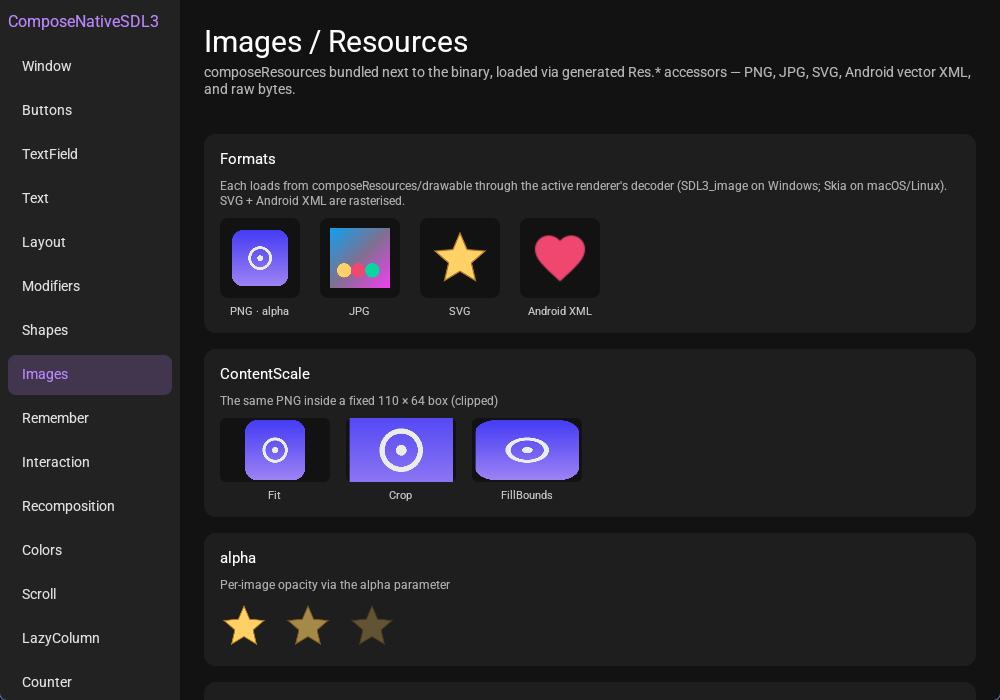
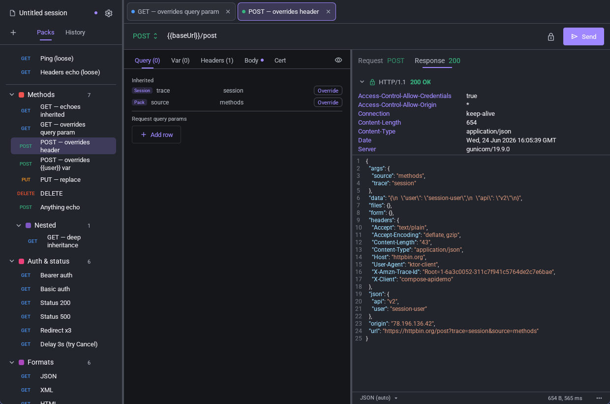

[](https://kotlinlang.org)
[](LICENSE.md)

# Compose Desktop Native

Run [Compose Multiplatform](https://github.com/JetBrains/compose-multiplatform)
as a native binary, with no JVM. Compose Desktop Native compiles to a single
executable for macOS (arm64), Linux (x64/arm64), and Windows (mingwX64), using
[SDL3](https://libsdl.org) for windowing and input.



## How it works

- **The runtime is the real one.** Composition, snapshots, and the recomposer
  are the official `org.jetbrains.compose.runtime` klibs from Maven, never
  reimplemented.
- **The UI layers are vendored upstream.** `androidx.compose.ui`, `foundation`,
  `animation`, and `material3` are copied from Compose Multiplatform verbatim
  wherever they compile as is, with project code filling in only the native glue.
  The same treatment extends to ecosystem libraries that stop short of
  Kotlin/Native desktop - Koin, Coil 3 and Pulse MVI are vendored and rebuilt for
  these targets, and you still declare their official coordinates.
- **Rendering is Skia everywhere.** macOS and Linux link the official Skiko
  klibs (Metal / OpenGL); Windows links the bitsycore Skiko fork, which ships
  Skiko and Skia together in `skiko-windows-x64.dll`.
- **The platform is SDL3.** Windowing, input, audio, filesystem, file dialogs,
  and clipboard all go through SDL3, so one code path covers every OS.
- **Lean distributables.** SDL3 is built as a static library and linked in. On
  macOS and Linux a distributable is just the executable plus a `data.kres`
  resource bundle; on Windows it also ships `skiko-windows-x64.dll` next to the
  exe (auto-provisioned by the bridge plugin).

| Platform | Gradle target | Renderer |
|----------|---------------|----------|
| macOS arm64 | `macosArm64` | Skia (Metal) - official Skiko |
| Linux x64 / arm64 | `linuxX64` / `linuxArm64` | Skia (OpenGL) - official Skiko |
| Windows | `mingwX64` | Skia - bitsycore Skiko fork |

## Quickstart

### A window

```kotlin
import androidx.compose.material3.Text
import com.compose.sdl.nativeComposeWindow

fun main() = nativeComposeWindow(title = "Hello") {
    Text("Hello from Compose Desktop Native")
}
```

The content lambda runs with a `ComposeWindowScope` receiver that exposes
`window: ComposeNativeWindow` (`setTitle`, `setSize`, `minimize`, `maximize`,
`setFullscreen`, `close`). The same handle is reachable from any nested
composable via `LocalComposeNativeWindow.current`.

For multiple windows, wrap them in `nativeComposeApp`, where the set of
`Window(...)` calls is state driven (Compose Desktop style):

```kotlin
fun main() = nativeComposeApp {
    Window(title = "Main", onCloseRequest = ::exitApplication) { /* ... */ }
    if (showInspector) {
        Window(title = "Inspector", onCloseRequest = { showInspector = false }) { /* ... */ }
    }
}
```

Each window gets its own `Lifecycle`, `ViewModelStore`, and `SavedStateRegistry`
owners, driven by real SDL focus and visibility events, so ViewModels and
saved state behave as they do on Android.

`Window()` takes the same attributes as Compose Desktop's - `undecorated`,
`transparent`, `resizable`, `enabled`, `focusable`, `alwaysOnTop`,
`onPreviewKeyEvent` and `onKeyEvent` - and re-applies them when they change.
(`transparent` is the one exception: SDL needs it at window-creation time, so it
is fixed for the window's life.)

When the Compose-level API doesn't reach far enough, drop to SDL directly:

```kotlin
val handles = window.rawSdlHandles()   // SDL_Window* / SDL_Renderer* / GL / Metal
handles.window?.let { sdl3.SDL_FlashWindow(it.reinterpret(), SDL_FLASH_BRIEFLY) }
```

The pointers are a snapshot valid only while the window lives, and which ones
are non-null depends on the resolved renderer (`glContext` for Skia OpenGL,
`metalView` for Metal, `renderer` for CPU raster).

### Building in this repo

```kotlin
commonMain.dependencies {
    implementation(project(":compose:desktop:native:desktop-native-window")) // window shell + main loop
    implementation(project(":compose:material3:material3"))   // Material 3 widgets
    implementation(project(":utils:material-symbols"))        // icon-font composables (optional)
}
```

### Building from your own project: the bridge plugin

The klibs publish to [maven.bitsycore.com](https://maven.bitsycore.com/releases)
(no auth) and GitHub Packages (authenticated fallback) under per-area coordinates that mirror
upstream - `com.bitsycore.compose.ui:ui`, `com.bitsycore.compose.foundation:foundation`,
… (the `com.bitsycore` fork of each `org.jetbrains.compose.*`). Apply
the bridge Gradle plugin once, declare the **official** Compose Multiplatform
coordinates, and the plugin swaps in the port's klibs on native desktop targets
while android, jvm, iOS, and wasm keep resolving the official artifacts.

```kotlin
// build.gradle.kts, official coordinates everywhere
plugins {
    kotlin("multiplatform")
    id("org.jetbrains.compose")
    id("com.bitsycore.compose-desktop-native.bridge") version "<release>"
}

commonMain.dependencies {
    // The plugin exposes the exact Compose versions the port tracks, so you
    // never hand-match them (material3 is versioned separately upstream).
    implementation("org.jetbrains.compose.runtime:runtime:${composeDesktopNative.composeRuntime}")
    implementation("org.jetbrains.compose.ui:ui:${composeDesktopNative.compose}")
    implementation("org.jetbrains.compose.foundation:foundation:${composeDesktopNative.compose}")
    implementation("org.jetbrains.compose.material3:material3:${composeDesktopNative.composeMaterial3}")
}
```

**One repository, no credentials.** `https://maven.bitsycore.com/releases`
carries both the port's artifacts and the bitsycore skiko fork
(`com.bitsycore.skiko`), which the Windows (mingwX64) target renders through;
macOS/Linux pull the official skiko from Maven Central instead. The exact
`repositories {}` snippet and version pinning:
[gradle-plugin/compose-desktop-native-bridge/README.md](gradle-plugin/compose-desktop-native-bridge/README.md).

For a complete project that applies the bridge and builds one shared UI for
Android, JVM, and native desktop, see the example repo:
[bitsycore/compose-desktop-native-bridge-example](https://github.com/bitsycore/compose-desktop-native-bridge-example).

## Sample apps

Both live in `commonMain` and also build for stock JVM Compose Desktop, which
serves as the visual and behavioural reference: any difference against the
native build is a porting bug.

**`:demo`** is a tour of the re-implemented Compose and Material 3 surface,
30-plus screens covering text, layout, shapes, images, state, lazy lists,
dialogs, canvas, graphics layers, animation, and gestures.

```bash
./gradlew :demo:runDebugExecutableMacosArm64   # macOS (Skia / Metal)
./gradlew :demo:runDebugExecutableLinuxX64     # Linux (Skia / OpenGL)
gradlew.bat :demo:runDebugExecutableMingwX64   # Windows (Skia / Skiko fork)
./gradlew :demo:run                            # JVM Compose Desktop (reference)
```

**`:apidemo`** is a Postman-style REST client built entirely on the library:
request collections, a session inheritance ladder, syntax-highlighted body
editors, a response viewer with timing and TLS-chain inspection, and mTLS
client certificates.



```bash
./gradlew :apidemo:runDebugExecutableMacosArm64
./gradlew :apidemo:run                         # JVM Compose Desktop (reference)
```

## Modules

One Gradle module per upstream artifact, and the Gradle path mirrors the
directory (`:compose:ui:ui`, `:compose:foundation:foundation`, …). The renderer
lives in `:compose:ui:ui` and the `sdl3` cinterop in `:sdl:sdl-core`;
`:compose:desktop:native:desktop-native-window` is the SDL integration layer.

Most of the androidx architecture stack (lifecycle, viewmodel, navigation3,
savedstate, navigationevent) ships real Kotlin/Native desktop klibs and runs on
the port unmodified. Where an ecosystem library stops short of Kotlin/Native
desktop, this repo vendors it verbatim from upstream and rebuilds it for these
targets, so you keep writing against the official coordinates:

| Vendored | Why | Published as |
|----------|-----|--------------|
| Compose `ui` / `foundation` / `animation` / `material3` | the port itself | `com.bitsycore.compose.*` |
| `components-resources`, `navigation3-ui` | no mingwX64 / linux klibs | `com.bitsycore.compose.components`, `com.bitsycore.navigation3` |
| **Koin** viewmodel + compose modules | apple + android only upstream (`koin-core` itself is fine) | `com.bitsycore.koin` |
| **Coil 3** (whole stack) | no mingwX64 anywhere; no desktop native at all for its compose layer | `com.bitsycore.coil3` |
| **Pulse MVI** | no desktop-native artifact upstream | `com.bitsycore.compose.desktop.native.pulse` |
| **material3-adaptive** (all four) | ios + macosArm64 only upstream - no linux, no mingw | `com.bitsycore.compose.material3.adaptive` |

The bridge plugin substitutes each of these on native desktop configurations, so
app code declares `io.insert-koin:koin-compose`, `io.coil-kt.coil3:coil-compose`
and so on exactly as it would anywhere else. The full module map, dependency
graph, and the list of compatible artifacts are in [CLAUDE.md](CLAUDE.md).

## Pinned versions

Everything below is pinned in exactly two files -
[`gradle/libs.versions.toml`](gradle/libs.versions.toml) (Maven coordinates) and
[`scripts/compose-fork/compose.properties`](scripts/compose-fork/compose.properties)
(the upstream git refs the vendored sources are copied from) - plus
[`scripts/build-sdl/build-sdl.properties`](scripts/build-sdl/build-sdl.properties)
for SDL3. A release tracks one Compose Multiplatform version; the table is the
contract.

**Version policy.** Anything Compose Multiplatform integrates is pinned to what
CMP ships - for the androidx mirrors, the *Jetpack* version CMP's release notes
map its `org.jetbrains.androidx.*` artifact to, since this port consumes the
google coordinates. Anything CMP does not integrate is pinned to the latest
release. Deliberate exceptions are commented in the catalog; there is currently
one (`savedstate`, below).

### Toolchain

| | Version | Notes |
|---|---|---|
| Kotlin | **2.4.20** | Newer than the 2.3.20 CMP 1.12.1 is built with. Kotlin/Native consumes older klibs fine, and the whole port builds clean on 2.4.20 with no klib API diff, so there is no reason to hold back. |
| Compose Multiplatform | **1.12.1** | The vendored sources are the `v1.12.1` tag of both upstream repos, and the JVM parity leg forces the same version - no dev-build skew. skiko is unchanged at 0.150.1, so the mingwX64 fork still matches its Skia base. |
| SDL3 | **release-3.4.16** | Built from source as a static lib per host (`scripts/build-sdl/build-all.py`), linked into the executable. |
| Skiko | **0.150.1** | macOS / Linux use the official `org.jetbrains.skiko`. |
| Skiko (Windows fork) | **0.150.1-mingw.2** | `com.bitsycore.skiko:skiko` - Skiko + Skia in `skiko-windows-x64.dll`. Same Skia base as the official build. Public repo, no auth. |

### Compose libraries

The port republishes each vendored artifact under a `com.bitsycore` group that
mirrors the upstream one, so the fork of any given coordinate is obvious. Apply
the bridge plugin and you keep declaring the **official** coordinate.

| Library | Official coordinate | Port coordinate |
|---|---|---|
| Runtime | `org.jetbrains.compose.runtime:runtime*:1.12.1` | *not forked - the official klibs serve every target* |
| UI | `org.jetbrains.compose.ui:ui*:1.12.1` | `com.bitsycore.compose.ui:ui*` |
| Foundation | `org.jetbrains.compose.foundation:foundation*:1.12.1` | `com.bitsycore.compose.foundation:foundation*` |
| Animation | `org.jetbrains.compose.animation:animation*:1.12.1` | `com.bitsycore.compose.animation:animation*` |
| Material Ripple | `org.jetbrains.compose.material:material-ripple:1.12.1` | `com.bitsycore.compose.material:material-ripple` |
| Material3 | `org.jetbrains.compose.material3:material3:1.12.0-alpha03` | `com.bitsycore.compose.material3:material3` |
| Material3 Adaptive | `org.jetbrains.compose.material3.adaptive:adaptive*:1.3.0-rc01` | `com.bitsycore.compose.material3.adaptive:adaptive*` |
| Resources | `org.jetbrains.compose.components:components-resources:1.12.1` | `com.bitsycore.compose.components:components-resources` |
| Navigation3 UI | `org.jetbrains.androidx.navigation3:navigation3-ui` | `com.bitsycore.navigation3:navigation3-ui` |
| Window shell | *no upstream equivalent* | `com.bitsycore.compose:desktop-native-window` |
| SDL layer | *no upstream equivalent* | `com.bitsycore.compose.sdl:sdl-core` |

Material3 rides its own release train upstream: `1.12.0-alpha03` **is** the
version Compose Multiplatform 1.12.1 ships (Jetpack Material3 1.5.0-alpha22).
material3-adaptive rides a third train again.

**material3-adaptive** (`adaptive`, `adaptive-layout`, `adaptive-navigation`,
`adaptive-navigation3`) is published upstream for ios and macosArm64 only - no
linux, no mingw. This port ships all four for every desktop-native target. It
needed no source changes at all: every platform actual the native legs want is
already in upstream's `nonAndroidMain` / `skikoMain` / `nativeMain`, and
`androidx.window:window-core` - the one dependency involved - has published
linux, mingw and macos klibs the whole time. The artifacts were missing only
because upstream never turned the targets on. `demo --screen=Adaptive` renders
a live `ListDetailPaneScaffold`.

### Ecosystem libraries

Vendored because upstream stops short of Kotlin/Native desktop. The bridge
substitutes them on native desktop targets only.

| Library | Official coordinate | Port coordinate | Why |
|---|---|---|---|
| Koin | `io.insert-koin:koin-compose*:4.2.2` | `com.bitsycore.koin:*` | apple + android only upstream |
| Koin core | `io.insert-koin:koin-core:4.2.2` | *not forked* | already ships mingwX64 + linux |
| Coil 3 | `io.coil-kt.coil3:coil*:3.6.3` | `com.bitsycore.coil3:*` | no mingwX64 anywhere; no desktop native at all for the compose layer |
| Pulse MVI | `com.bitsycore.lib:pulse*:0.3.7` | `com.bitsycore.compose.desktop.native.pulse:*` | no desktop-native artifact upstream - and Pulse is itself a `com.bitsycore` library, so the republish is namespaced under this project |

Koin's `koin-compose-viewmodel-navigation` is deliberately **not** provided: it
needs Navigation 2's `navigation-compose`, which has no mingwX64 or linux klibs
under either coordinate set. Use `koin-compose-navigation3`.

### AndroidX, used as-is

These publish real Kotlin/Native desktop klibs and run on the port unmodified -
nothing is vendored or substituted. The port standardises on the **google**
`androidx.*` coordinates; do not also pull the `org.jetbrains.androidx.*`
mirrors or you will have every class twice.

| Library | Coordinate |
|---|---|
| Lifecycle / ViewModel | `androidx.lifecycle:lifecycle-*:2.11.0` |
| SavedState | `androidx.savedstate:savedstate*:1.5.0` (CMP builds against 1.4.0; lifecycle 2.11.0 requires it only as a *minimum*, so 1.5.0 resolves cleanly and gives consumers the newer API) |
| Navigation3 runtime | `androidx.navigation3:navigation3-runtime:1.1.7` |
| Navigation Event | `androidx.navigationevent:navigationevent-compose:1.1.2` |
| Collection | `androidx.collection:collection:1.5.0` |
| Graphics Shapes | `androidx.graphics:graphics-shapes:1.1.0` |

## Building

Build the native libraries once per machine, then build any app target:

```bash
python3 scripts/build-sdl/build-all.py         # SDL3 (static)
./gradlew :demo:runDebugExecutableMacosArm64
```

Every host needs `git`, `cmake`, and Python 3. Per host: macOS needs the Xcode
command line tools; Linux needs gcc/g++ and the X11 / Wayland / audio dev
headers; Windows needs a mingw-w64 g++ on PATH. See [TOOLING.md](TOOLING.md) for
the full build and verification workflow.

## Support

[Bitsycore's Discord](https://discord.gg/kGnraVAtDR)

## Documentation

- [TOOLING.md](TOOLING.md): building the native libs, vendoring, and verification.
- [CLAUDE.md](CLAUDE.md): architecture, source-set hierarchy, vendoring rules,
  density flow, and a per-area file map.
- [gradle-plugin/compose-desktop-native-bridge](gradle-plugin/compose-desktop-native-bridge/README.md):
  consuming the port from another build.

## License

[MIT](LICENSE.md).
